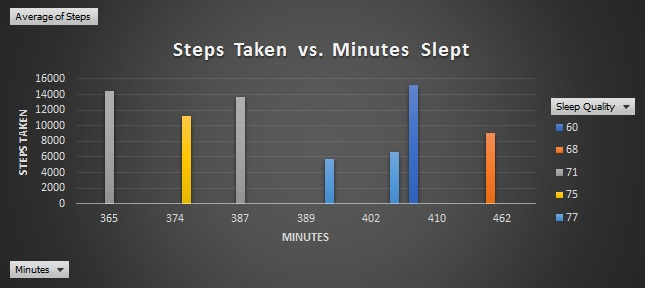

# ISTE Sleep Analytics
## Sleep Project 2017

## Overview
* The primary objective of the project is to monitor the correlation of sleep quality and environmental factors (Sleep Hygiene) via data collected from air quality, light, temperature and humidity sensors.
* This forms an Internet of Things sensor network hosted on a Raspberry Pi server. By analyzing the data thus obtained, meaningful results are hoped to be derived.

## Results

Sleep Quality Measurements : Range from 68-77 (Purple - Yellow)

* Morning & Night Measurements

* Morning Measurements

* Night Measurements

* Sleep Quality vs. Air Quality

* Sleep Quality based on: Steps VS Minutes

